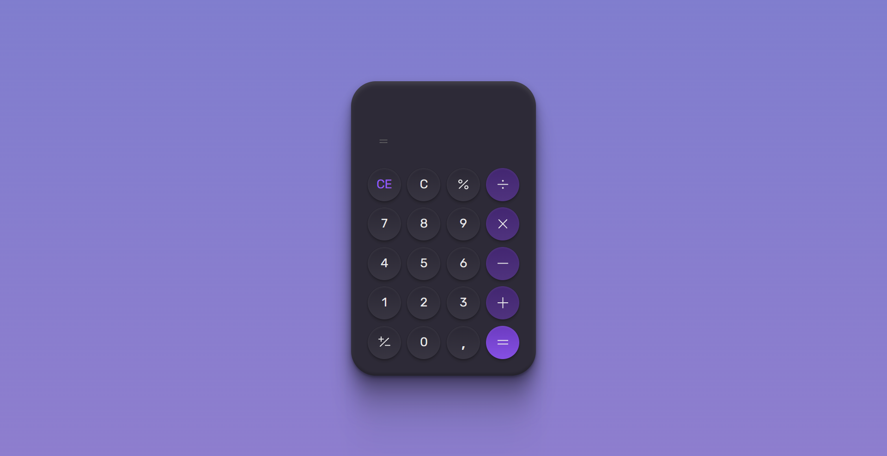

<h1 align="center"><strong> #boraCodar a Calculator 🔢 </strong></h1>
  
<h2><strong>Proposal</strong></h2>

 The objective was to program a calculator that performs basic mathematical operations but works in the best possible way. 

#

#### <h3 align="center"><strong> That project was developed with </strong></h3>

#### <h3 align="center">HTML | CSS | JavaScript | Figma | Git | GitHub </h3>

#

- 
<a href="https://anaaaab.github.io/calculator/" target="_blank"> Access Habits App online </a> 

#
  

<strong>Made with 🤍 by Ana Paula Bertuol </strong>

  

#### 
<a href="https://www.linkedin.com/in/ana-paula-bertuol/" target="_blank"> Access my profile on LinkedIn here </a> 

